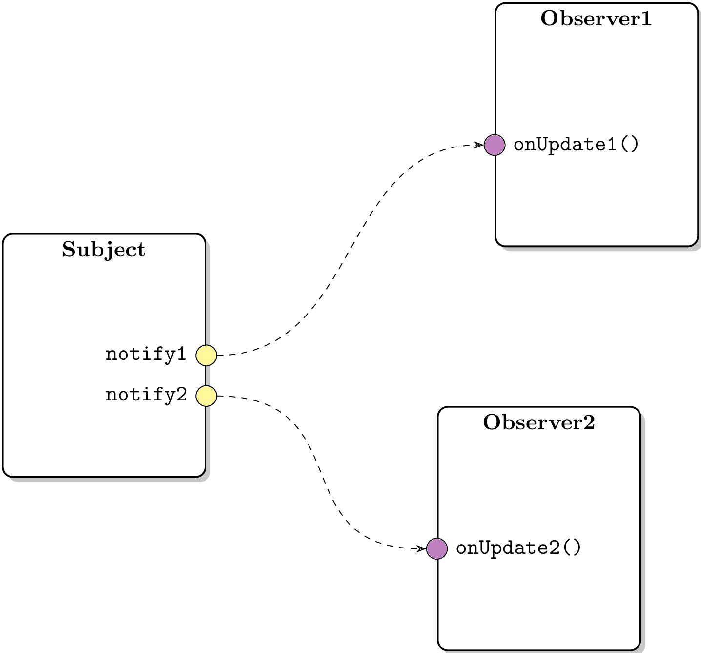

libCppEvent
===========

## Overview

[libCppEvent](https://github.com/zhanggyb/libCppEvent) is a simple C++11 event/delegate (signal/slot) implementation, inspired by:

- [Member Function Pointers and the Fastest Possible C++ Delegates](http://www.codeproject.com/Articles/7150/Member-Function-Pointers-and-the-Fastest-Possible)
by Don Clugston
- [The Impossibly Fast C++ Delegates](http://www.codeproject.com/Articles/11015/The-Impossibly-Fast-C-Delegates) by Sergey Ryazanov
- [Fast C++ Delegate: Boost.Function 'drop-in' replacement and multicast](http://www.codeproject.com/Articles/18389/Fast-C-Delegate-Boost-Function-drop-in-replacement) by JaeWook Choi
- [CppEvents](http://code.google.com/p/cpp-events/) by Nickolas V. Pohilets

## Features

- Based on fast C++ delegates
- Take advantage of C++11 variadic template, which makes the code concise and easy to maintain
- Multicast
- Events can be virtual and pure virtual
- Event chaining
- Automatic disconnecting

## Usage

Using libCppEvent for communication between objects is simple and fast. Just declare event with template class `CppEvent::Event<>` and connect it to a member function of a `CppEvent::Observer` when needed. The event can be fired at appropriate time in your application and invoke the member function connected. As illustrated below:

The event can multicast and be connected to a virtual (even pure virtual) function. It can also be disconnected manually or automatically when observer object is destroyed. For more information, please see the [Wiki page](https://github.com/zhanggyb/libCppEvent/wiki).

## Known Issue

This project currently does not support MSVC.(FIXME)

## License

This project is licensed under MIT License, which can be found in the LICENSE
file. The license is also included at the top of each source file.
